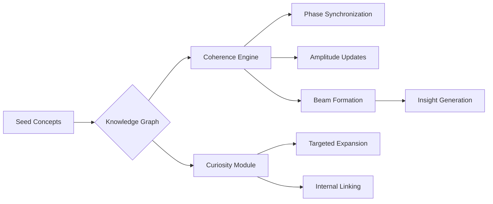

# 🌌 Physics-Inspired Coherent AI System

READ THE PAPER PLEASE

https://github.com/axelnissim-personal/coherence/blob/main/coherence_paper.md

Example Run
https://github.com/axelnissim-personal/coherence/blob/main/25032025010403.pdf

A cognitive architecture modeling knowledge as phase-coherent states, blending laser physics with machine learning.

## Table of Contents
- [Key Features](#key-features)
- [Architecture Overview](#architecture-overview)
- [Installation](#installation)
- [Quick Start](#quick-start)
- [Core Components](#core-components)
- [Advanced Configuration](#advanced-configuration)
- [Example Output](#example-output)
- [Theory Background](#theory-background)
- [License](#license)
- [Attribution](#attribution)

## Key Features

### 🧠 Phase-Coherent Knowledge Representation
- **Oscillator Network**: Concepts as nodes with:
  - Phase (θ): Alignment state (0-2π)
  - Amplitude (A): Importance (0-1)
- **Kuramoto Dynamics**: 
  ```python
  def update_phase(current_phase, natural_frequency, coupling_term):
      return current_phase + natural_frequency + coupling_term
  ```
- Eigenvector Centrality: Amplitude updates via spectral methods

### 🔍 Autonomous Exploration
Curiosity metric combining multiple factors:

```python
def calculate_curiosity(uncertainty, reward_gradient, novelty, phase, amplitude):
    return (0.25 * uncertainty + 
            0.2 * reward_gradient + 
            0.3 * novelty + 
            0.15 * math.cos(phase) + 
            0.1 * amplitude)
```

### 📊 Knowledge Emergence
Coherent beam formation threshold:

```python
def check_coherence(amplitudes, phases):
    coherence = abs(sum(A * math.exp(1j * theta) for A, theta in zip(amplitudes, phases))) / sum(amplitudes)
    return coherence > 0.65
```

## Architecture Overview



## Installation

```bash
pip install -r requirements.txt
```

### requirements.txt
```
ratelimit>=2.2.1
networkx>=3.0
torch>=2.0
sentence-transformers>=2.2.2
matplotlib>=3.7
google-generativeai>=0.3.0
```

## Quick Start

```python
# Initialize system
from coherent_ai import UniversalIntelligence
ui = UniversalIntelligence()

# Seed knowledge
concepts = [
    ("Quantum Superposition", {"is related to": "Wavefunction Collapse"}),
    ("Entanglement", {"requires": "Quantum Correlation"})
]
ui.seed_initial_concepts(concepts)

# Run learning
for cycle in range(5):
    ui.autonomous_learning_cycle()
    
# Generate report
ui.generate_html_report()
```

## Core Components

### CoherenceEngine Class

| Parameter | Default | Description |
|-----------|---------|-------------|
| K | 0.15 | Coupling strength |
| θ_thresh | 0.65 | Coherence threshold |
| α | 0.85 | Reward decay |

#### Key Methods:
- `update_dynamics(steps=3)`: Full synchronization cycle
- `calculate_coherence()`: Returns C ∈ [0,1]

### CuriosityModule Class

#### Exploration Strategies:

Targeted Expansion:
```python
def targeted_knowledge_expansion(concept):
    # Expand knowledge around a specific concept
    pass
```

Internal Linking:
```python
def explore_internal_links(top_n=5):
    # Create connections between existing concepts
    pass
```

## Advanced Configuration

### Tuning Physics Parameters

```python
class CustomEngine(CoherenceEngine):
    def __init__(self):
        super().__init__()
        self.K = 0.25  # Stronger coupling
        self.θ = 0.7   # Higher coherence bar
```

### Custom Exploration

```python
def custom_curiosity(self, concept):
    return (0.5 * self.uncertainty(concept) 
            + 0.3 * self.reward_gradient(concept))
```

## Example Output

### Coherent Beam:
```
- Neural Correlates (A:0.82, θ:1.12)
- Qualia (A:0.78, θ:1.05)
- Binding Problem (A:0.75, θ:1.18)
```

### Generated Insight:
"The phase alignment between 'Neural Correlates' and 'Qualia' suggests consciousness emerges from synchronized network dynamics rather than localized activity..."

## Theory Background

### Laser Physics Analogies

| AI Component | Laser Equivalent |
|--------------|-----------------|
| Phase Synchronization | Mode Locking |
| Beam Formation | Stimulated Emission |
| Amplitude | Photon Density |

### Mathematical Foundations

#### Kuramoto Model:
```
θ̇_i = ω_i + (K/N) * Σ sin(θ_j - θ_i)
```

#### Coherence Metric:
```
C = |Σ(A_j * e^(iθ_j))| / Σ(A_j)
```

## License

This project is licensed under the GNU General Public License v3.0 (GPL-3.0). See the [LICENSE](LICENSE) file for details.

## Attribution

Originally developed by Axel Nissim S. 

### Citation
```bibtex
@software{CoherenceI2025,
  author = {Axel Nissim S.},
  title = {Physics-Inspired Coherent AI System},
  url = {https://github.com/axelnissim-personal/coherence/},
  year = {2025},
  license = {GPL-3.0}
}
```

**Note**: Requires GPU for optimal performance with sentence-transformers. For troubleshooting, see issues.
